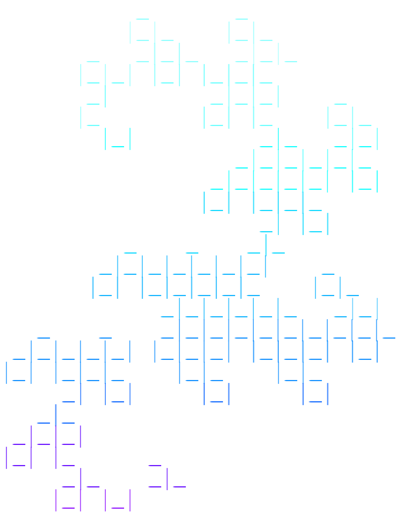

# Fun interpreter

<p align="center">
  
</p>

A small interpreter for a functional language with integer literals, addition, `let` bindings, functions, function application, and static lazy evaluation.

The bundled examples demonstrate Church numerals and Y-combinator programs.

## Requirements

- GNU Make
- GCC and the POSIX regex library (available on typical Linux systems)

## Commands

```sh
make       # build bin/main
make run   # build, then run the bundled examples
make clean # remove bin/ and obj/
```

The program waits for Enter before evaluating the examples.

## Examples

Programs live in the `examples/` directory as `.fun` files. `make run` loads every `.fun` file in that directory.

## Language

Let $\mathrm{Var}$ be the set of identifiers, formally variables $x,y,z, \dots$. Let $\mathrm{Val}$ be the set of values an identifier can be assigned to: it can either be a natural number $\mathbb{N}$ or a closure $C$, which is a tuple that represents a function.

Let $\mathrm{Envs}$ be the set of environments. Under eager evaluation, an environment

```math
E : \mathrm{Var} \overset{\mathrm{fin}}{\rightharpoonup}\mathrm{Val}
```

is a function which associates identifiers with runtime values.

Under lazy evaluation, an environment may also associate an identifier with a suspended computation, called a thunk. Thus, lazy environments associate variables with bindings $b$, where a binding is either a value $v$ or a thunk $\theta = \langle M,E\rangle$.

Informally, the role of environments is to associate a given identifier $x$ with a runtime binding $b$

```math
E(x) = b
```

Under eager evaluation, such a binding is a value $v \in \mathrm{Val}$, so it can either be a natural number or a closure $C$.

An environment $E$ can be extended with a new binding for a variable $x$

```math
E[x \to b]
```

The new binding shadows any previous binding for the same identifier

```math
E[x\to b](y) =
\begin{cases}
b  &  \text{if } y = x  \\
E(y)  & \text{otherwise}
\end{cases}
```

### Syntax

Let $x,y,z \in \mathrm{Var}$ range over identifiers and let $n \in \mathbb{N}$ range over integer constants. The abstract syntax of Fun is defined by

```math
\begin{array}{rcl}
M,N
& ::= &
n
\mid x
\mid M + N
\mid \mathrm{let}\ x = M\ \mathrm{in}\ N
\mid \mathrm{fn}\ x \Rightarrow M
\mid M\,N
\end{array}
```

Where function application is left-associative:

```math
f \ x \ y
```

is parsed as

```math
(f \ x) \ y
```

Functions with multiple arguments can be represented by currying

```math
\mathrm{fn} \mkern3mu x \ y  \Rightarrow M \quad  \equiv \quad  \mathrm{fn} \mkern3mu x \Rightarrow (\mathrm{fn} \mkern3mu y \Rightarrow M)
```

The concrete syntax used by the interpreter is the following grammar:

```math
\begin{array}{rcl}
\mathrm{expr}
& ::= &
\mathrm{sum}
\\[0.2em]
\mathrm{sum}
& ::= &
\mathrm{application}\;(\texttt{+}\;\mathrm{application})^{*}
\\[0.2em]
\mathrm{application}
& ::= &
\mathrm{term}\;\mathrm{term}^{*}
\\[0.2em]
\mathrm{term}
& ::= &
\textit{INT}
\mid \textit{VAR}
\mid \texttt{(}\,\mathrm{expr}\,\texttt{)}
\mid \ell
\mid f
\\[0.2em]
\ell
& ::= &
\texttt{let}\ \textit{VAR}\ \texttt{=}\ \mathrm{expr}
\texttt{in}\ \mathrm{expr}
\\[0.2em]
f
& ::= &
\texttt{fn}\ \textit{VAR}\ \texttt{=>}\ \mathrm{expr}
\end{array}
```

### Environments and Values

Under static scoping, a function value is represented by a closure of the form

```math
\langle x,M,E\rangle
```

consisting of its parameter $x$, body $M$, and the environment in which the function was defined, $E$.

Thus, for eager static evaluation

```math
\mathrm{Val}_{s} = \mathbb{N} \cup \left( \mathrm{Var} \times \mathrm{Fun} \times \mathrm{Envs} \right)
```

Under dynamic scoping, the definition environment is not retained:

```math
\mathrm{Val}_{d} = \mathbb{N} \cup (\mathrm{Var} \times \mathrm{Fun})
```

We define a judgement using the relation $\vdash_{\sigma}$

```math
E \vdash_{\sigma} M \leadsto v
```

which means that the expression $M$, evaluated in the environment $E$ according to the strategy $\sigma$, produces value $v$.

The interpreter supports the following strategies

```math
\sigma \in
\{
\mathsf{SE},
\mathsf{DE},
\mathsf{SL}
\}
```

where
- $\mathsf{SE}$ static scoping, eager evaluation
- $\mathsf{DE}$ dynamic scoping, eager evaluation
- $\mathsf{SL}$ static scoping, lazy evaluation

As to why there is no $\mathsf{DL}$, dynamic scoping with lazy evaluation, it is because it is fundamentally broken 🤷

Suppose we would like to compute the output of this function

```math
(\mathrm{fn} \mkern3mu x \Rightarrow (\mathrm{fn} \mkern3mu y \Rightarrow x))\ 0\ 1
```

Evaluation would go something like this:

1. Evaluate $(\mathrm{fn} \mkern3mu x \Rightarrow (\mathrm{fn} \mkern3mu y \Rightarrow x))\ 0$
2. Temporarily introduce the dynamic binding $x \to 0$ and return $(\mathrm{fn} \mkern3mu y \Rightarrow x)$
3. Once the first function finishes, the dynamic binding for $x$ disappears
4. Because evaluation is lazy, the argument $1$ does not need to be evaluated unless $y$ is used
5. The body of the function $\mathrm{fn} \mkern3mu y \Rightarrow x$ asks for the value of $x$, but because the earlier binding $x \to 0$ is no longer active, there is no other value for $x$!
6. Therefore the variable $x$ is unbound

### Static Eager Semantics

Evaluates function arguments before entering the function body. Functions capture their definition environment.

```math
\mathrm{[const]}_{\mathsf{SE}}
\qquad
E \vdash_{\mathsf{SE}} n \leadsto n
```

```math
\mathrm{[var]}_{\mathsf{SE}}
\qquad
\dfrac{
E(x)=v
}{
E \vdash_{\mathsf{SE}} x \leadsto v
}
```

```math
\mathrm{[plus]}_{\mathsf{SE}}
\qquad
\dfrac{
E \vdash_{\mathsf{SE}} M \leadsto n_1
\qquad
E \vdash_{\mathsf{SE}} N \leadsto n_2
}{
E \vdash_{\mathsf{SE}} M+N
\leadsto n_1+n_2
}
```

```math
\mathrm{[let]}_{\mathsf{SE}}
\qquad
\dfrac{
E \vdash_{\mathsf{SE}} M \leadsto v
\qquad
E[x\to v]
\vdash_{\mathsf{SE}} N
\leadsto w
}{
E \vdash_{\mathsf{SE}}
\mathrm{let}\ x=M\ \mathrm{in}\ N
\leadsto w
}
```

```math
\mathrm{[fn]}_{\mathsf{SE}}
\qquad
E \vdash_{\mathsf{SE}}
\mathrm{fn}\ x\Rightarrow M
\leadsto
\langle x,M,E\rangle
```

```math
\mathrm{[appl]}_{\mathsf{SE}}
\qquad
\dfrac{
E \vdash_{\mathsf{SE}} M
\leadsto
\langle x,P,F\rangle
\qquad
E \vdash_{\mathsf{SE}} N
\leadsto v
\qquad
F[x\to v]
\vdash_{\mathsf{SE}} P
\leadsto w
}{
E \vdash_{\mathsf{SE}} M\,N
\leadsto w
}
```

### Dynamic Eager Semantics

Under dynamic scoping, functions do not capture their definition environment. Free variables are resolved using the environment active at the point of application.

The rules for constants, variables, addition, and `let` are analogous to the static eager rules.

```math
\mathrm{[const]}_{\mathsf{DE}}
\qquad
E \vdash_{\mathsf{DE}} n \leadsto n
```

```math
\mathrm{[var]}_{\mathsf{DE}}
\qquad
\dfrac{
E(x)=v
}{
E \vdash_{\mathsf{DE}} x \leadsto v
}
```

```math
\mathrm{[plus]}_{\mathsf{DE}}
\qquad
\dfrac{
E \vdash_{\mathsf{DE}} M \leadsto n_1
\qquad
E \vdash_{\mathsf{DE}} N \leadsto n_2
}{
E \vdash_{\mathsf{DE}} M+N
\leadsto n_1+n_2
}
```

```math
\mathrm{[let]}_{\mathsf{DE}}
\qquad
\dfrac{
E \vdash_{\mathsf{DE}} M \leadsto v
\qquad
E[x\to v]
\vdash_{\mathsf{DE}} N
\leadsto w
}{
E \vdash_{\mathsf{DE}}
\mathrm{let}\ x=M\ \mathrm{in}\ N
\leadsto w
}
```

The ones that change are:

```math
\mathrm{[fn]}_{\mathsf{DE}}
\qquad
E \vdash_{\mathsf{DE}}
\mathrm{fn}\ x\Rightarrow M
\leadsto
\langle x,M\rangle
```

```math
\mathrm{[appl]}_{\mathsf{DE}}
\qquad
\dfrac{
E \vdash_{\mathsf{DE}} M
\leadsto
\langle x,P\rangle
\qquad
E \vdash_{\mathsf{DE}} N
\leadsto v
\qquad
E[x\to v]
\vdash_{\mathsf{DE}} P
\leadsto w
}{
E \vdash_{\mathsf{DE}} M\,N
\leadsto w
}
```

### Static Lazy Semantics

Lazy evaluation delays the computation of an expression until its value is actually required.

Suspended computations are represented by "thunks":

```math
\theta = \langle M,E\rangle,
```

where $M$ is the suspended expression and $E$ is the environment in which the expression must eventually be evaluated.

Hence, as introduced above, lazy environments contain either values or thunks:

```math
b ::= v \mid \langle M,E\rangle .
```

```math
\mathrm{[const]}_{\mathsf{SL}}
\qquad
E \vdash_{\mathsf{SL}} n \leadsto n
```

```math
\mathrm{[fn]}_{\mathsf{SL}}
\qquad
E \vdash_{\mathsf{SL}}
\mathrm{fn}\ x\Rightarrow M
\leadsto
\langle x,M,E\rangle
```

```math
\mathrm{[var]}_{\mathsf{SL}}
\qquad
\dfrac{
E(x)=v
}{
E \vdash_{\mathsf{SL}}
x \leadsto v
}
```

```math
\mathrm{[force]}_{\mathsf{SL}}
\qquad
\dfrac{
E(x)=\langle M,F\rangle
\qquad
F \vdash_{\mathsf{SL}} M
\leadsto v
}{
E \vdash_{\mathsf{SL}}
x \leadsto v
}
```

```math
\mathrm{[plus]}_{\mathsf{SL}}
\qquad
\dfrac{
E \vdash_{\mathsf{SL}} M
\leadsto n_1
\qquad
E \vdash_{\mathsf{SL}} N
\leadsto n_2
}{
E \vdash_{\mathsf{SL}}
M+N
\leadsto n_1+n_2
}
```

```math
\mathrm{[appl]}_{\mathsf{SL}}
\qquad
\dfrac{
E \vdash_{\mathsf{SL}} M
\leadsto
\langle x,P,F\rangle
\qquad
F[x\to\langle N,E\rangle]
\vdash_{\mathsf{SL}} P
\leadsto v
}{
E \vdash_{\mathsf{SL}}
M\,N
\leadsto v
}
```

The implementation also delays the right-hand side of a `let` binding.

Let $F$ be the recursively extended environment

```math
F
=
E[x\to\langle M,F\rangle].
```

Then

```math
\mathrm{[let]}_{\mathsf{SL}}
\qquad
\dfrac{
F
=
E[x\to\langle M,F\rangle]
\qquad
F \vdash_{\mathsf{SL}} N
\leadsto v
}{
E \vdash_{\mathsf{SL}}
\mathrm{let}\ x=M\ \mathrm{in}\ N
\leadsto v
}
```

### Call-by-Need

The preceding lazy rules describe when suspended expressions are forced. The interpreter additionally memoizes the results of every evaluated thunk.
**Therefore a thunk is only evaluated once!**

Thus, operationally, a thunk has the form

```math
\langle M,E,s,c\rangle,
```

where $s$ records its evaluation state and $c$ optionally stores the cached value.

After the first successful evaluation, the thunk

```math
\langle M,E,\mathsf{unevaluated},\bot\rangle
```

is updated to

```math
\langle M,E,\mathsf{evaluated},v\rangle.
```

Subsequent evaluations immediately return $v$.
